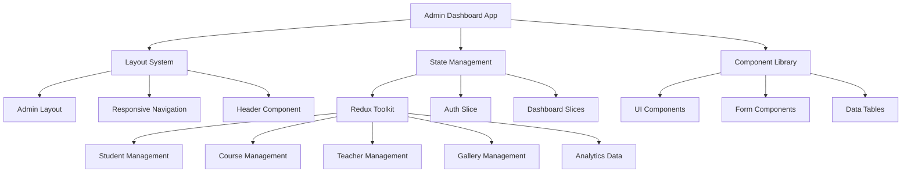

# Design Document

## Overview

The AdminDashboard is a comprehensive CMS built with Next.js 14, TypeScript, and Tailwind CSS, following the existing Graviton Academy design patterns. The system provides a complete administrative interface with role-based access control, responsive design, and seamless integration with the existing platform architecture.

The dashboard will feature a modern sidebar navigation layout, comprehensive data management modules, and real-time analytics. All components will maintain the platform's green/emerald color theme and support both Bengali and English languages.

## Architecture

### High-Level Architecture



### Folder Structure

```
app/
├── (admin)/                           # Admin Dashboard Routes
│   ├── layout.tsx                     # Admin Layout with Sidebar/Header
│   ├── dashboard/
│   │   └── page.tsx                   # Dashboard Home with Analytics
│   ├── students/
│   │   ├── page.tsx                   # Student List & Management
│   │   ├── create/
│   │   │   └── page.tsx               # Create New Student
│   │   └── [studentId]/
│   │       ├── page.tsx               # Student Details
│   │       └── edit/
│   │           └── page.tsx           # Edit Student
│   ├── courses/
│   │   ├── page.tsx                   # Course List & Management
│   │   ├── create/
│   │   │   └── page.tsx               # Create New Course
│   │   └── [courseId]/
│   │       ├── page.tsx               # Course Details
│   │       ├── edit/
│   │       │   └── page.tsx           # Edit Course
│   │       └── content/
│   │           ├── page.tsx           # Manage Course Content
│   │           ├── subjects/
│   │           │   └── page.tsx       # Manage Subjects
│   │           ├── chapters/
│   │           │   └── page.tsx       # Manage Chapters
│   │           └── materials/
│   │               └── page.tsx       # Manage Materials (MCQ/PDF/Video)
│   ├── teachers/
│   │   ├── page.tsx                   # Teacher List & Management
│   │   ├── create/
│   │   │   └── page.tsx               # Create New Teacher
│   │   └── [teacherId]/
│   │       ├── page.tsx               # Teacher Details
│   │       └── edit/
│   │           └── page.tsx           # Edit Teacher
│   ├── admissions/
│   │   ├── page.tsx                   # Admission Requests List
│   │   └── [requestId]/
│   │       └── page.tsx               # Admission Request Details
│   ├── clubs/
│   │   ├── page.tsx                   # Club Management
│   │   ├── create/
│   │   │   └── page.tsx               # Create New Club
│   │   └── [clubId]/
│   │       ├── page.tsx               # Club Details
│   │       ├── edit/
│   │       │   └── page.tsx           # Edit Club
│   │       └── gallery/
│   │           └── page.tsx           # Manage Club Gallery
│   ├── gallery/
│   │   ├── page.tsx                   # Gallery Management
│   │   ├── upload/
│   │   │   └── page.tsx               # Upload Media
│   │   └── albums/
│   │       ├── page.tsx               # Manage Albums
│   │       └── [albumId]/
│   │           └── page.tsx           # Album Details
│   ├── magazine/
│   │   ├── page.tsx                   # Article Management
│   │   ├── create/
│   │   │   └── page.tsx               # Create New Article
│   │   └── [articleId]/
│   │       ├── page.tsx               # Article Details
│   │       └── edit/
│   │           └── page.tsx           # Edit Article
│   ├── analytics/
│   │   ├── page.tsx                   # Analytics Dashboard
│   │   ├── students/
│   │   │   └── page.tsx               # Student Analytics
│   │   ├── courses/
│   │   │   └── page.tsx               # Course Analytics
│   │   └── reports/
│   │       └── page.tsx               # Generate Reports
│   ├── settings/
│   │   ├── page.tsx                   # System Settings
│   │   ├── users/
│   │   │   └── page.tsx               # User Management
│   │   ├── roles/
│   │   │   └── page.tsx               # Role Management
│   │   └── general/
│   │       └── page.tsx               # General Settings
│   └── profile/
│       └── page.tsx                   # Admin Profile

components/
├── layouts/
│   └── admin/
│       ├── AdminLayout.tsx            # Main Admin Layout
│       ├── AdminSidebar.tsx           # Sidebar Navigation
│       ├── AdminHeader.tsx            # Header with User Info
│       └── AdminBreadcrumb.tsx        # Breadcrumb Navigation
├── admin/
│   ├── dashboard/
│   │   ├── StatsCards.tsx             # Dashboard Statistics Cards
│   │   ├── RecentActivity.tsx         # Recent Activity Feed
│   │   ├── AnalyticsCharts.tsx        # Charts and Graphs
│   │   └── QuickActions.tsx           # Quick Action Buttons
│   ├── students/
│   │   ├── StudentList.tsx            # Student Data Table
│   │   ├── StudentForm.tsx            # Create/Edit Student Form
│   │   ├── StudentDetails.tsx         # Student Detail View
│   │   └── StudentFilters.tsx         # Search and Filter Controls
│   ├── courses/
│   │   ├── CourseList.tsx             # Course Data Table
│   │   ├── CourseForm.tsx             # Create/Edit Course Form
│   │   ├── CourseDetails.tsx          # Course Detail View
│   │   ├── ContentManager.tsx         # Course Content Management
│   │   └── MaterialUpload.tsx         # File Upload Component
│   ├── teachers/
│   │   ├── TeacherList.tsx            # Teacher Data Table
│   │   ├── TeacherForm.tsx            # Create/Edit Teacher Form
│   │   ├── TeacherDetails.tsx         # Teacher Detail View
│   │   └── TeacherAssignments.tsx     # Course Assignment Management
│   ├── admissions/
│   │   ├── AdmissionList.tsx          # Admission Requests Table
│   │   ├── AdmissionDetails.tsx       # Admission Request Details
│   │   └── AdmissionActions.tsx       # Approve/Reject Actions
│   ├── clubs/
│   │   ├── ClubList.tsx               # Club Management Table
│   │   ├── ClubForm.tsx               # Create/Edit Club Form
│   │   └── ClubGallery.tsx            # Club Gallery Management
│   ├── gallery/
│   │   ├── MediaGrid.tsx              # Media Grid Display
│   │   ├── MediaUpload.tsx            # Media Upload Component
│   │   ├── AlbumManager.tsx           # Album Management
│   │   └── MediaFilters.tsx           # Media Search and Filters
│   ├── analytics/
│   │   ├── AnalyticsDashboard.tsx     # Main Analytics View
│   │   ├── ChartComponents.tsx        # Reusable Chart Components
│   │   ├── ReportGenerator.tsx        # Report Generation
│   │   └── MetricsCards.tsx           # Key Metrics Display
│   └── settings/
│       ├── SystemSettings.tsx         # System Configuration
│       ├── UserManagement.tsx         # User Management Interface
│       ├── RoleManagement.tsx         # Role and Permission Management
│       └── GeneralSettings.tsx        # General Platform Settings
└── ui/
    ├── DataTable.tsx                  # Reusable Data Table
    ├── FileUpload.tsx                 # File Upload Component
    ├── ImageUpload.tsx                # Image Upload with Preview
    ├── RichTextEditor.tsx             # Rich Text Editor for Content
    ├── DatePicker.tsx                 # Date Selection Component
    ├── MultiSelect.tsx                # Multi-select Dropdown
    ├── StatusBadge.tsx                # Status Indicator Badge
    ├── ConfirmDialog.tsx              # Confirmation Dialog
    ├── LoadingSpinner.tsx             # Loading State Component
    └── EmptyState.tsx                 # Empty State Placeholder

store/
├── slices/
│   ├── authSlice.ts                   # Authentication State
│   ├── dashboardSlice.ts              # Dashboard Analytics State
│   ├── studentSlice.ts                # Student Management State
│   ├── courseSlice.ts                 # Course Management State
│   ├── teacherSlice.ts                # Teacher Management State
│   ├── admissionSlice.ts              # Admission Management State
│   ├── clubSlice.ts                   # Club Management State (extend existing)
│   ├── gallerySlice.ts                # Gallery Management State
│   ├── magazineSlice.ts               # Magazine/Article Management State
│   ├── analyticsSlice.ts              # Analytics Data State
│   └── settingsSlice.ts               # System Settings State
├── types/
│   ├── admin.ts                       # Admin-specific Types
│   ├── student.ts                     # Student Data Types
│   ├── course.ts                      # Course Data Types
│   ├── teacher.ts                     # Teacher Data Types
│   ├── admission.ts                   # Admission Data Types
│   ├── gallery.ts                     # Gallery Data Types
│   ├── analytics.ts                   # Analytics Data Types
│   └── settings.ts                    # Settings Data Types
└── index.ts                           # Store Configuration

lib/
├── validations/
│   ├── admin.ts                       # Admin Form Validations
│   ├── student.ts                     # Student Form Validations
│   ├── course.ts                      # Course Form Validations
│   ├── teacher.ts                     # Teacher Form Validations
│   └── gallery.ts                     # Gallery Form Validations
└── utils/
    ├── adminHelpers.ts                # Admin Utility Functions
    ├── dataExport.ts                  # Data Export Utilities
    └── fileUpload.ts                  # File Upload Utilities
```

## Components and Interfaces

### Core Layout Components

#### AdminLayout Component
```typescript
interface AdminLayoutProps {
  children: React.ReactNode;
}

interface SidebarItem {
  id: string;
  label: string;
  labelEn: string;
  icon: React.ComponentType;
  href: string;
  badge?: number;
  submenu?: SidebarItem[];
}
```

#### AdminSidebar Component
```typescript
interface AdminSidebarProps {
  isCollapsed: boolean;
  onToggle: () => void;
  currentPath: string;
}

interface NavigationStructure {
  dashboard: SidebarItem;
  students: SidebarItem;
  courses: SidebarItem;
  teachers: SidebarItem;
  admissions: SidebarItem;
  clubs: SidebarItem;
  gallery: SidebarItem;
  magazine: SidebarItem;
  analytics: SidebarItem;
  settings: SidebarItem;
}
```

#### AdminHeader Component
```typescript
interface AdminHeaderProps {
  user: AdminUser;
  notifications: Notification[];
  onLogout: () => void;
}

interface AdminUser {
  id: string;
  name: string;
  email: string;
  role: 'super_admin' | 'admin' | 'moderator';
  avatar?: string;
  lastLogin: string;
}
```

### Data Management Components

#### DataTable Component
```typescript
interface DataTableProps<T> {
  data: T[];
  columns: TableColumn<T>[];
  loading?: boolean;
  pagination?: PaginationConfig;
  filters?: FilterConfig[];
  actions?: TableAction<T>[];
  onRowClick?: (row: T) => void;
  onSort?: (column: string, direction: 'asc' | 'desc') => void;
}

interface TableColumn<T> {
  key: keyof T;
  label: string;
  sortable?: boolean;
  render?: (value: any, row: T) => React.ReactNode;
  width?: string;
}
```

#### Form Components
```typescript
interface FormFieldProps {
  name: string;
  label: string;
  type: 'text' | 'email' | 'password' | 'textarea' | 'select' | 'file' | 'date';
  required?: boolean;
  validation?: ValidationRule[];
  options?: SelectOption[];
  placeholder?: string;
  helpText?: string;
}

interface FileUploadProps {
  accept: string;
  maxSize: number;
  multiple?: boolean;
  onUpload: (files: File[]) => void;
  preview?: boolean;
}
```

## Data Models

### Authentication and User Management

#### Admin User Model
```typescript
interface AdminUser {
  id: string;
  email: string;
  password: string; // hashed
  firstName: string;
  lastName: string;
  role: AdminRole;
  permissions: Permission[];
  avatar?: string;
  phone?: string;
  isActive: boolean;
  lastLogin?: string;
  createdAt: string;
  updatedAt: string;
}

interface AdminRole {
  id: string;
  name: 'super_admin' | 'admin' | 'moderator' | 'content_manager';
  displayName: string;
  permissions: Permission[];
}

interface Permission {
  id: string;
  name: string;
  resource: string;
  action: 'create' | 'read' | 'update' | 'delete';
}
```

### Student Management

#### Student Model
```typescript
interface Student {
  id: string;
  studentId: string; // unique student ID
  firstName: string;
  lastName: string;
  email: string;
  phone: string;
  dateOfBirth: string;
  gender: 'male' | 'female' | 'other';
  address: Address;
  guardian: Guardian;
  academicInfo: AcademicInfo;
  enrolledCourses: CourseEnrollment[];
  status: 'active' | 'inactive' | 'suspended';
  avatar?: string;
  createdAt: string;
  updatedAt: string;
}

interface Guardian {
  name: string;
  relationship: string;
  phone: string;
  email?: string;
  occupation?: string;
}

interface AcademicInfo {
  class: string;
  section?: string;
  rollNumber?: string;
  institution: string;
  board: string;
  passingYear?: string;
}

interface CourseEnrollment {
  courseId: string;
  enrolledAt: string;
  status: 'enrolled' | 'completed' | 'dropped';
  progress: number; // percentage
  grade?: string;
}
```

### Course Management

#### Course Model
```typescript
interface Course {
  id: string;
  title: string;
  titleEn: string;
  description: string;
  category: CourseCategory;
  level: 'beginner' | 'intermediate' | 'advanced';
  duration: number; // in hours
  price: number;
  currency: 'BDT';
  thumbnail: string;
  status: 'draft' | 'published' | 'archived';
  instructor: string; // teacher ID
  subjects: Subject[];
  totalStudents: number;
  rating: number;
  tags: string[];
  createdAt: string;
  updatedAt: string;
}

interface Subject {
  id: string;
  title: string;
  titleEn: string;
  description: string;
  order: number;
  chapters: Chapter[];
}

interface Chapter {
  id: string;
  title: string;
  titleEn: string;
  description: string;
  order: number;
  materials: CourseMaterial[];
}

interface CourseMaterial {
  id: string;
  title: string;
  type: 'video' | 'pdf' | 'mcq' | 'assignment' | 'quiz';
  content: string; // URL or content
  duration?: number; // for videos
  order: number;
  isRequired: boolean;
}
```

### Teacher Management

#### Teacher Model
```typescript
interface Teacher {
  id: string;
  employeeId: string;
  firstName: string;
  lastName: string;
  email: string;
  phone: string;
  dateOfBirth: string;
  gender: 'male' | 'female' | 'other';
  address: Address;
  qualifications: Qualification[];
  experience: Experience[];
  specializations: string[];
  assignedCourses: string[]; // course IDs
  avatar: string;
  bio: string;
  bioEn: string;
  socialLinks: SocialLinks;
  status: 'active' | 'inactive';
  joinDate: string;
  salary?: number;
  createdAt: string;
  updatedAt: string;
}

interface Qualification {
  degree: string;
  institution: string;
  year: string;
  grade?: string;
}

interface Experience {
  position: string;
  organization: string;
  startDate: string;
  endDate?: string;
  description: string;
}

interface SocialLinks {
  facebook?: string;
  linkedin?: string;
  twitter?: string;
  website?: string;
}
```

### Admission Management

#### Admission Request Model
```typescript
interface AdmissionRequest {
  id: string;
  applicationId: string;
  applicantInfo: ApplicantInfo;
  academicInfo: AcademicInfo;
  coursePreferences: CoursePreference[];
  documents: Document[];
  status: 'pending' | 'under_review' | 'approved' | 'rejected';
  reviewedBy?: string; // admin ID
  reviewNotes?: string;
  submittedAt: string;
  reviewedAt?: string;
  createdAt: string;
  updatedAt: string;
}

interface ApplicantInfo {
  firstName: string;
  lastName: string;
  email: string;
  phone: string;
  dateOfBirth: string;
  gender: 'male' | 'female' | 'other';
  address: Address;
  guardian: Guardian;
}

interface CoursePreference {
  courseId: string;
  priority: number;
}

interface Document {
  id: string;
  type: 'photo' | 'certificate' | 'transcript' | 'id_card';
  name: string;
  url: string;
  uploadedAt: string;
}
```

### Gallery Management

#### Gallery Model
```typescript
interface GalleryItem {
  id: string;
  title: string;
  titleEn: string;
  description?: string;
  type: 'photo' | 'video';
  url: string;
  thumbnail?: string;
  category: 'general' | 'events' | 'clubs' | 'achievements';
  tags: string[];
  albumId?: string;
  clubId?: string;
  uploadedBy: string; // admin ID
  isPublic: boolean;
  isFeatured: boolean;
  metadata: MediaMetadata;
  createdAt: string;
  updatedAt: string;
}

interface Album {
  id: string;
  title: string;
  titleEn: string;
  description?: string;
  cover: string;
  items: string[]; // gallery item IDs
  isPublic: boolean;
  createdBy: string;
  createdAt: string;
  updatedAt: string;
}

interface MediaMetadata {
  size: number;
  dimensions?: {
    width: number;
    height: number;
  };
  duration?: number; // for videos
  format: string;
}
```

### Analytics and Reporting

#### Analytics Model
```typescript
interface DashboardAnalytics {
  overview: OverviewStats;
  studentMetrics: StudentMetrics;
  courseMetrics: CourseMetrics;
  recentActivity: ActivityItem[];
  chartData: ChartData[];
}

interface OverviewStats {
  totalStudents: number;
  totalCourses: number;
  totalTeachers: number;
  pendingAdmissions: number;
  monthlyGrowth: {
    students: number;
    courses: number;
    revenue: number;
  };
}

interface StudentMetrics {
  activeStudents: number;
  newEnrollments: number;
  completionRate: number;
  averageProgress: number;
  topPerformers: Student[];
}

interface CourseMetrics {
  publishedCourses: number;
  totalEnrollments: number;
  averageRating: number;
  popularCourses: Course[];
  revenueByMonth: RevenueData[];
}

interface ActivityItem {
  id: string;
  type: 'student_enrolled' | 'course_created' | 'admission_approved' | 'content_uploaded';
  description: string;
  timestamp: string;
  userId?: string;
  metadata?: any;
}
```

## Dummy Data Structure for Redux

### Authentication Slice with Demo Credentials
```typescript
interface AuthState {
  user: AdminUser | null;
  isAuthenticated: boolean;
  loading: boolean;
  error: string | null;
  demoCredentials: DemoCredentials;
}

interface DemoCredentials {
  admin: {
    email: 'admin@graviton.edu.bd';
    password: 'admin123';
    role: 'super_admin';
  };
  student: {
    email: 'student@graviton.edu.bd';
    password: 'student123';
    role: 'student';
  };
}
```

### Sample Dummy Data
```typescript
// Sample Students Data
const dummyStudents: Student[] = [
  {
    id: 'std-001',
    studentId: 'GA2024001',
    firstName: 'রাহুল',
    lastName: 'আহমেদ',
    email: 'rahul@example.com',
    phone: '01712345678',
    // ... other fields with Bengali names and realistic data
  },
  // ... more dummy students
];

// Sample Courses Data
const dummyCourses: Course[] = [
  {
    id: 'course-001',
    title: 'উচ্চ মাধ্যমিক পদার্থবিজ্ঞান',
    titleEn: 'Higher Secondary Physics',
    description: 'HSC পদার্থবিজ্ঞানের সম্পূর্ণ কোর্স',
    category: 'academic',
    level: 'intermediate',
    // ... other fields
  },
  // ... more dummy courses
];

// Sample Teachers Data
const dummyTeachers: Teacher[] = [
  {
    id: 'teacher-001',
    employeeId: 'GA-T-001',
    firstName: 'ড. মোহাম্মদ',
    lastName: 'করিম',
    email: 'karim@graviton.edu.bd',
    specializations: ['পদার্থবিজ্ঞান', 'গণিত'],
    // ... other fields
  },
  // ... more dummy teachers
];
```

## Correctness Properties

*A property is a characteristic or behavior that should hold true across all valid executions of a system-essentially, a formal statement about what the system should do. Properties serve as the bridge between human-readable specifications and machine-verifiable correctness guarantees.*

### Property Reflection

After analyzing all acceptance criteria, I identified several areas where properties can be consolidated:

- Navigation and UI rendering properties can be combined into comprehensive interface properties
- Form validation properties across different modules share common patterns
- Data management properties (CRUD operations) follow similar patterns across entities
- File upload and processing properties can be unified
- Access control properties can be consolidated into comprehensive permission checking

### Core System Properties

**Property 1: Dashboard Interface Completeness**
*For any* authenticated admin user, when accessing the dashboard, all required navigation elements (sidebar, header, user info, logout) should be present and functional
**Validates: Requirements 1.1, 1.2, 1.4**

**Property 2: Responsive Navigation Behavior**
*For any* screen size change, the navigation should adapt appropriately (collapsible sidebar on mobile/tablet, full sidebar on desktop) while maintaining functionality
**Validates: Requirements 1.3, 10.1, 10.4**

**Property 3: Role-Based Access Control**
*For any* admin user with specific role permissions, only authorized modules and actions should be accessible, and unauthorized access attempts should be blocked
**Validates: Requirements 9.1, 9.3, 9.4**

**Property 4: Form Validation Consistency**
*For any* form submission across the system, all required fields should be validated using consistent rules, and appropriate error messages should be displayed in Bengali
**Validates: Requirements 2.2, 11.1, 11.2**

**Property 5: Data CRUD Operations Integrity**
*For any* data entity (student, course, teacher, etc.), create, read, update, and delete operations should maintain data integrity and referential consistency
**Validates: Requirements 2.3, 2.5, 3.5, 4.4**

**Property 6: File Upload and Processing**
*For any* file upload operation, the system should validate file types and formats, process them correctly, and handle errors gracefully
**Validates: Requirements 3.2, 4.2, 6.1, 11.3**

**Property 7: Search and Filter Functionality**
*For any* data listing page, search and filter operations should return accurate results and maintain performance with large datasets
**Validates: Requirements 2.1, 5.5, 7.3**

**Property 8: Data Display Completeness**
*For any* detail view (student, course, teacher, admission), all required information should be displayed accurately and completely
**Validates: Requirements 2.4, 5.2, 7.1**

**Property 9: Workflow Automation**
*For any* approval/rejection workflow (admissions, content publishing), the system should execute all required automated actions and notifications
**Validates: Requirements 3.4, 5.3, 5.4**

**Property 10: Content Organization and Management**
*For any* content management operation (gallery, courses, clubs), organizational features (categories, tags, albums) should work correctly and maintain relationships
**Validates: Requirements 6.2, 6.3, 3.3**

**Property 11: Analytics and Reporting Accuracy**
*For any* analytics calculation or report generation, the data should be accurate, up-to-date, and properly filtered according to specified criteria
**Validates: Requirements 7.1, 7.2, 7.3, 7.4**

**Property 12: System Configuration Persistence**
*For any* system setting or configuration change, the updates should be properly saved, applied immediately, and persist across system restarts
**Validates: Requirements 8.1, 8.2, 8.3, 8.4**

**Property 13: Real-time Updates and State Management**
*For any* data change in the system, related views and cached data should update appropriately, and state should be consistent across components
**Validates: Requirements 7.5, 9.5, 12.2, 12.3, 12.4**

**Property 14: Error Handling and Recovery**
*For any* system error or network failure, appropriate error messages should be displayed, and recovery options (retry, rollback) should be available
**Validates: Requirements 11.4, 11.5, 12.3**

**Property 15: Responsive Design Consistency**
*For any* screen size or device type, the interface should remain functional, accessible, and visually consistent while adapting to the available space
**Validates: Requirements 10.1, 10.2, 10.3, 10.4**

## Error Handling

### Error Categories and Handling Strategies

#### 1. Validation Errors
- **Client-side validation**: Immediate feedback using React Hook Form and Zod schemas
- **Server-side validation**: Backend validation with detailed error responses
- **Display strategy**: Inline field errors with Bengali localization
- **Recovery**: Allow user to correct and resubmit

#### 2. Network and API Errors
- **Connection failures**: Detect network issues and show appropriate messages
- **Timeout handling**: Implement request timeouts with retry mechanisms
- **Rate limiting**: Handle API rate limits gracefully with backoff strategies
- **Recovery**: Automatic retry with exponential backoff, manual retry options

#### 3. Authentication and Authorization Errors
- **Session expiry**: Detect expired sessions and redirect to login
- **Permission denied**: Show clear messages for unauthorized access attempts
- **Role changes**: Handle real-time permission updates
- **Recovery**: Automatic re-authentication, clear permission explanations

#### 4. File Upload Errors
- **Size limits**: Validate file sizes before upload
- **Format validation**: Check file types and formats
- **Upload failures**: Handle network interruptions during uploads
- **Recovery**: Resume interrupted uploads, clear error feedback

#### 5. Data Consistency Errors
- **Concurrent modifications**: Detect and resolve data conflicts
- **Referential integrity**: Prevent deletion of referenced data
- **State synchronization**: Handle state inconsistencies
- **Recovery**: Conflict resolution dialogs, data refresh options

#### 6. System Errors
- **Component crashes**: Error boundaries to catch React errors
- **Memory issues**: Monitor and handle memory constraints
- **Performance degradation**: Detect and respond to slow operations
- **Recovery**: Graceful degradation, component isolation

### Error Reporting and Logging

#### User-Facing Error Messages
- Bengali localization for all error messages
- Clear, actionable error descriptions
- Contextual help and guidance
- Progressive disclosure of technical details

#### System Logging
- Comprehensive error logging with context
- User action tracking for debugging
- Performance monitoring and alerts
- Security event logging

## Testing Strategy

### Dual Testing Approach

The AdminDashboard will employ both unit testing and property-based testing to ensure comprehensive coverage and correctness validation.

#### Unit Testing Focus Areas
- **Component rendering**: Verify components render correctly with various props
- **User interactions**: Test click handlers, form submissions, navigation
- **Edge cases**: Boundary conditions, empty states, error scenarios
- **Integration points**: Component interactions, API integrations
- **Accessibility**: Screen reader compatibility, keyboard navigation

#### Property-Based Testing Focus Areas
- **Universal properties**: Test properties that should hold for all inputs
- **Data transformations**: Verify data integrity across operations
- **State management**: Test state consistency and transitions
- **Permission systems**: Validate access control across all scenarios
- **Form validation**: Test validation rules with generated inputs

### Testing Configuration

#### Property-Based Testing Setup
- **Library**: Use `fast-check` for TypeScript property-based testing
- **Iterations**: Minimum 100 iterations per property test
- **Shrinking**: Enable automatic counterexample shrinking
- **Seeding**: Use deterministic seeds for reproducible tests

#### Test Organization
- **Feature-based structure**: Organize tests by admin dashboard features
- **Shared utilities**: Common test helpers and mock data generators
- **Test data factories**: Generate realistic test data for all entities
- **Mock services**: Mock external dependencies and APIs

#### Coverage Requirements
- **Unit tests**: 90% code coverage for critical components
- **Property tests**: 100% coverage of correctness properties
- **Integration tests**: End-to-end workflows and user journeys
- **Performance tests**: Load testing for data-heavy operations

### Test Implementation Guidelines

#### Property Test Tags
Each property-based test must include a comment tag referencing the design document property:

```typescript
// Feature: admin-dashboard, Property 1: Dashboard Interface Completeness
it('should display all required navigation elements for any authenticated admin', () => {
  // Property test implementation
});
```

#### Mock Data Strategy
- **Realistic data**: Use Bengali names, addresses, and content
- **Edge cases**: Include boundary values and special characters
- **Relationships**: Maintain referential integrity in test data
- **Scalability**: Generate large datasets for performance testing

#### Test Environment Setup
- **Isolated state**: Each test starts with clean Redux state
- **Mock APIs**: Consistent API responses for predictable testing
- **Browser simulation**: Test responsive behavior with viewport changes
- **Accessibility testing**: Automated accessibility checks in tests

### Continuous Testing Integration

#### Pre-commit Testing
- **Fast unit tests**: Run critical tests before each commit
- **Linting and formatting**: Ensure code quality standards
- **Type checking**: Validate TypeScript types and interfaces

#### CI/CD Pipeline Testing
- **Full test suite**: Run all unit and property tests
- **Cross-browser testing**: Validate compatibility across browsers
- **Performance regression**: Monitor for performance degradation
- **Security scanning**: Check for security vulnerabilities

#### Production Monitoring
- **Error tracking**: Monitor production errors and crashes
- **Performance metrics**: Track page load times and user interactions
- **User feedback**: Collect and analyze user-reported issues
- **A/B testing**: Test new features with subset of users